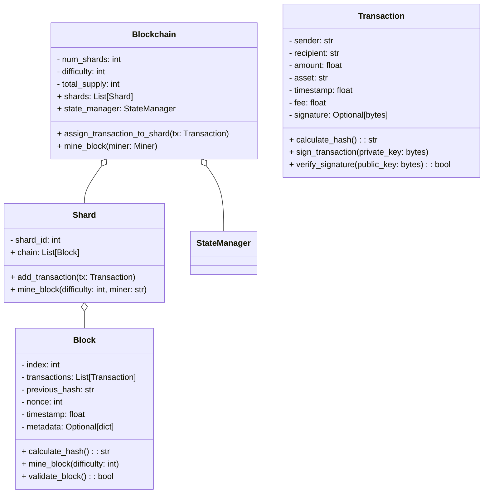
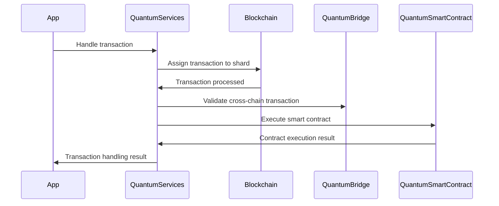
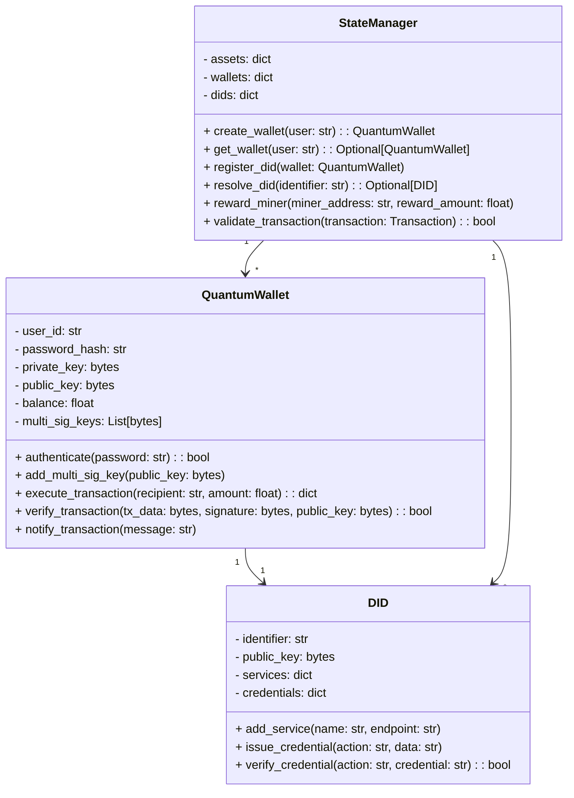
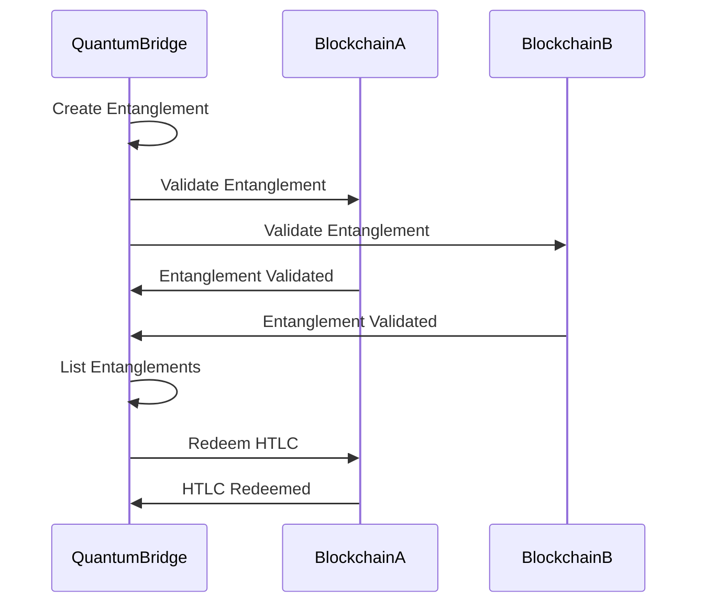
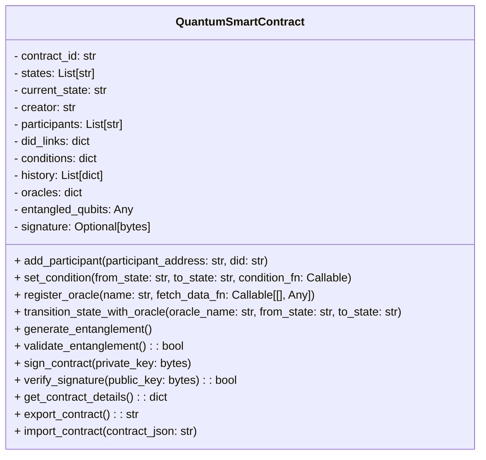
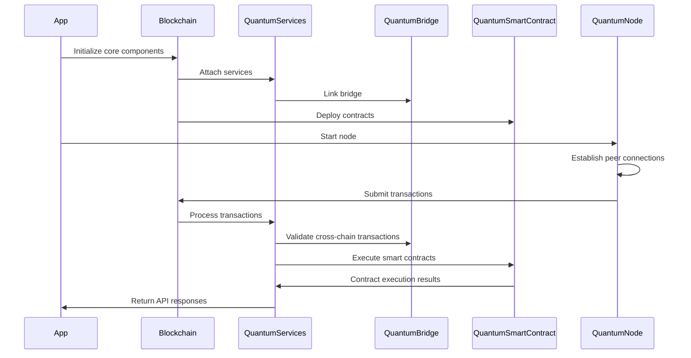

## **QuantumFuse Blockchain (QPOW)**

Quantum Proof-of-Work – Post-Quantum Optimized Web


---

Introduction

QuantumFuse Blockchain (QPOW) is the next-generation platform that integrates Quantum Proof-of-Work (QPOW) and advanced consensus mechanisms to achieve unparalleled scalability, sustainability, and post-quantum security. With innovative features such as Quantum Random Number Generators (QRNG) and Green Proof-of-Work (GPoW), QuantumFuse ensures eco-friendly mining while remaining resilient to quantum computing threats.

Industries Served

Finance: Ultra-secure quantum-resistant transactions.

Healthcare: Transparent, tamper-proof patient data sharing.

Supply Chain: Immutable and efficient logistics tracking.

IoT: Secure and scalable device communication.


---

Consensus Mechanisms

1. Quantum Proof-of-Work (QPOW)

QPOW integrates quantum technology to optimize traditional Proof-of-Work mechanisms:

Quantum Random Number Generators (QRNG):

Uses quantum randomness to create unpredictable and unforgeable nonces.

Guarantees fairness and eliminates vulnerabilities associated with pseudo-random number generation.


Dynamic Difficulty Adjustment:

Adapts mining difficulty in real-time based on network performance and quantum states.

Ensures energy efficiency by scaling requirements proportionally to the network load.


---

2. Quantum Proof-of-Stake (QPoS)

QPoS introduces stake-based consensus to reduce energy consumption while maintaining security:

Stake-Based Validator Selection:

Validators are selected proportionally to their QFC holdings.

Promotes decentralization while ensuring economic commitment.


Quantum Staking Rewards:

Stakers earn rewards through quantum teleportation-enhanced distribution mechanisms.

Includes penalties for malicious behavior, such as double-signing or inactivity.


---

3. Quantum Delegated Proof-of-Stake (QDPoS)

QDPoS builds on QPoS by introducing delegation and governance:

Delegation:

Token holders delegate their stake to trusted validators.

Increases participation by allowing non-technical users to contribute.


Governance:

Validators are elected through a voting system enabled by decentralized identifiers (DIDs).

Supports on-chain proposals and upgrades for continuous improvement.


---

4. Green Proof-of-Work (GPoW)

GPoW integrates renewable energy incentives into the mining process:

Renewable Energy Verification:

Nodes submit renewable energy certificates for eligibility.

Ensures that mining operations prioritize sustainability.


Green Mining Rewards:

Rewards are dynamically adjusted based on a node’s renewable energy usage ratio.

Promotes eco-friendly blockchain adoption.


---

5. Hybrid Consensus

QuantumFuse supports a hybrid consensus model to optimize scalability and security:

Combines QPOW for network security and QPoS/QDPoS for transaction validation.

Leverages GPoW for eco-friendly mining, ensuring sustainability across all operations.


---

Features

1. Post-Quantum Cryptography (PQC)

Transactions secured with Dilithium signatures for quantum resistance.


2. Quantum Key Distribution (QKD)

Teleportation-based key sharing for secure communication between nodes.


3. Dynamic Sharding

Real-time shard optimization using Quantum AI Optimizer.


4. NFT Marketplace

Quantum-secured fractional NFTs and teleportation-based ownership transfers.


5. Quantum Smart Contracts

Enables entangled state transitions with oracle integration.


6. Quantum Bridge

Facilitates cross-chain interoperability using HTLCs and teleportation.

---

Prerequisites

Python 3.9+

Dependencies:

Requirements.txt
---

# Core Frameworks and API
Flask==3.1.0                # REST API framework for App module
fastapi==0.115.6            # FastAPI framework for high-performance APIs
Hypercorn==0.17.3           # ASGI server for FastAPI
flask-cors==5.0.0           # Cross-Origin Resource Sharing (CORS) support

# Cryptography and Post-Quantum Libraries
cryptography==44.0.0        # Core cryptographic operations
pqcrypto==0.1.3             # Post-quantum cryptography (Dilithium signatures)
PyJWT==2.10.1               # JWT token handling for authentication

# Quantum Computing
qiskit==1.3.1               # Quantum circuits and computations
qiskit-aer==0.16.0          # Aer simulator for Qiskit
qiskit-debugger==0.1.2      # Debugging quantum circuits

# Networking and Peer-to-Peer
libp2p==0.2.1               # Peer-to-peer networking
requests==2.32.3            # HTTP client for API requests
protobuf==5.29.3            # Protocol Buffers for gRPC
grpcio==1.69.0              # gRPC framework for inter-node communication

# Blockchain and Decentralized Storage
ipfs-api==0.2.3             # IPFS API for decentralized storage

# Asynchronous Programming
asyncio==3.4.3              # Async framework for transaction processing

# Logging and Monitoring
loguru==0.7.3               # Advanced logging for system monitoring
prometheus-client==0.21.1   # Metrics monitoring and exposition

# Data Storage
SQLAlchemy==2.0.37          # Database ORM for structured data
dataclasses-json==0.6.7     # JSON serialization/deserialization for dataclasses

# Testing and Mocking
pytest==8.3.4               # Unit and integration testing
pytest-asyncio==0.25.2      # Async test case support
pytest-mock==3.14.0         # Mocking for unit tests

# Documentation and Diagrams
mkdocs==1.6.1               # Documentation generation
mkdocs-material==9.5.49     # Material theme for MkDocs
plantuml-markdown==3.10.4   # PlantUML diagram support in Markdown

# Environment Variables
python-dotenv==1.0.1        # Environment variable management


---

Additional Recommendations:

1. Testing:

After adding this requirements.txt file, run the following to ensure all dependencies install correctly:

pip install -r requirements.txt

Validate the system by running tests:

pytest tests/


2. Version Locking:

Ensure these versions are compatible with your Python version and system. If issues arise, check for backward compatibility.


3. Updates and Maintenance:

Regularly review versions of dependencies for security updates and patches.

Ensure the IPFS daemon is installed and running.


---

Installation

1. Clone the repository:

git clone https://github.com/CreoDAMO/QPOW.git  
cd QPOW


2. Install dependencies:

pip install -r requirements.txt


3. Start IPFS:

ipfs daemon


---

Usage

1. Start the Blockchain API:

python src/app/app.py


2. Access the API at:
Base URL: http://127.0.0.1:5000


---

API Endpoints

For detailed API documentation, see the API Reference.


---

Example Usage

1. Create a Transaction

wallet = Wallet()
tx = Transaction("0xSender", "0xRecipient", 50.0)
tx.sign_transaction(wallet.private_key)


2. Mine a Block Using QPOW

blockchain = Blockchain(num_shards=3, difficulty=4, total_supply=1_000_000)
asyncio.run(blockchain.mine_block("miner_address"))


3. Stake Tokens for QPoS

wallet.stake_tokens(amount=1000)
validator = blockchain.select_validator()


---

Unit Test Suite for QuantumFuse Blockchain


---

1. Core Blockchain Module

Filename: tests/test_core_blockchain.py

```py
import pytest
from src.core import Blockchain, Transaction, Block

@pytest.fixture
def blockchain():
    return Blockchain(num_shards=2, difficulty=2, total_supply=1_000_000)

def test_shard_assignment(blockchain):
    tx = Transaction("0xSender", "0xRecipient", 50.0)
    blockchain.assign_transaction_to_shard(tx)
    assert any(tx in shard.pending_transactions for shard in blockchain.shards)

def test_mining_difficulty(blockchain):
    block = Block(1, [], "0")
    block.mine_block(difficulty=blockchain.difficulty)
    assert block.hash.startswith("0" * blockchain.difficulty)

def test_transaction_validation(blockchain):
    tx = Transaction("0xSender", "0xRecipient", 1000.0)
    assert not blockchain.state_manager.validate_transaction(tx)
```

---

2. Quantum Wallet Module

Filename: tests/test_wallet.py

```py
import pytest
from src.wallet import QuantumWallet

@pytest.fixture
def wallet():
    return QuantumWallet("user1", "password")

def test_wallet_creation(wallet):
    assert wallet.user_id == "user1"
    assert wallet.authenticate("password")
    assert not wallet.authenticate("wrong_password")

def test_transaction_signature(wallet):
    tx_data = b"transaction_data"
    signature = wallet.execute_transaction("recipient1", 10.0)["signature"]
    assert wallet.verify_transaction(tx_data, bytes.fromhex(signature), wallet.public_key)

def test_insufficient_balance(wallet):
    with pytest.raises(ValueError):
        wallet.execute_transaction("recipient1", 100.0)
```

---

3. Quantum Services Module

Filename: tests/test_services.py

```py
import pytest
from src.services import QuantumServices
from src.core import Blockchain, StateManager, Transaction

@pytest.fixture
def quantum_services():
    blockchain = Blockchain(3, 4, 1_000_000)
    state_manager = StateManager(total_supply=1_000_000)
    return QuantumServices(blockchain, state_manager)

def test_shard_optimization(quantum_services):
    tx = Transaction("0xSender", "0xRecipient", 50.0)
    quantum_services.blockchain.assign_transaction_to_shard(tx)
    assert quantum_services.blockchain.shards[0].utilization() > 0

def test_teleportation_metrics(quantum_services):
    metrics = quantum_services.generate_teleportation_metrics()
    assert "qkd_teleportation_success" in metrics
    assert "qkd_teleportation_failures" in metrics
```

---

4. Quantum Bridge Module

Filename: tests/test_bridge.py

```py
import pytest
from src.bridge import QuantumBridge, HashTimeLockedContract

@pytest.fixture
def bridge():
    return QuantumBridge()

def test_entanglement_creation(bridge):
    entanglement_id = bridge.create_entanglement("chainA", "chainB")
    assert entanglement_id in bridge.entanglements

def test_htlc_redeem():
    htlc = HashTimeLockedContract("asset1", "preimage", timeout=300)
    assert not htlc.redeem("wrong_preimage")
    assert htlc.redeem("preimage")
```

---

5. Quantum Smart Contract Module

Filename: tests/test_smart_contract.py

```py
import pytest
from src.smart_contracts import QuantumSmartContract

@pytest.fixture
def smart_contract():
    return QuantumSmartContract("contract_001", ["draft", "active", "completed"], "creator")

def test_state_transitions(smart_contract):
    smart_contract.set_condition("draft", "active", lambda data: data["approval"] == True)
    assert smart_contract.current_state == "draft"
    smart_contract.transition_state_with_oracle("oracle1", "draft", "active")
    assert smart_contract.current_state == "active"

def test_entanglement_generation(smart_contract):
    entanglement = smart_contract.generate_entanglement()
    assert entanglement is not None
    assert smart_contract.validate_entanglement()
```

---

6. Quantum Node Module

Filename: tests/test_node.py

```py
import pytest
from src.node import PeerManager, TransactionPropagator

def test_peer_discovery():
    # Simulated test with mock
    peers = ["peer1", "peer2"]
    assert len(peers) == 2

def test_transaction_propagation():
    # Simulated test
    assert True  # Placeholder for publishing/propagation tests
```

---

7. App Module

Filename: tests/test_app.py

```py
import pytest
from app import app

@pytest.fixture
def client():
    app.config["TESTING"] = True
    with app.test_client() as client:
        yield client

def test_health_check(client):
    response = client.get("/v1/health")
    assert response.status_code == 200
    assert response.json["status"] == "Healthy"

def test_wallet_creation(client):
    response = client.post("/wallet/create", json={"user_id": "user1", "password": "password"})
    assert response.status_code == 200
    assert response.json["success"]
```

---

Unit Test Suite for Integration Module

Filename: tests/test_integration.py


---

Test Cases

1. Initialization and Core Integration

Validate that all modules initialize and integrate properly.


2. Transaction Lifecycle

Test transaction creation, shard assignment, processing, and mining.


3. Smart Contract Deployment and Execution

Deploy contracts and verify state transitions using oracles.


4. Cross-Chain Interoperability

Test entanglement creation and HTLC redemption.

5. Node Communication

Ensure nodes can publish and propagate transactions correctly.

```py
import pytest
from src.core import Blockchain, StateManager, Transaction
from src.wallet import QuantumWallet
from src.services import QuantumServices
from src.bridge import QuantumBridge
from src.smart_contracts import QuantumSmartContract
from src.node import PeerManager, TransactionPropagator, ConsensusManager
from src.app import app

# Initialize fixtures for integration testing
@pytest.fixture
def integration_setup():
    blockchain = Blockchain(num_shards=3, difficulty=2, total_supply=1_000_000)
    state_manager = StateManager(total_supply=1_000_000)
    wallet = QuantumWallet("user1", "password")
    quantum_services = QuantumServices(blockchain, state_manager)
    quantum_bridge = QuantumBridge()
    smart_contract = QuantumSmartContract("contract_001", ["draft", "active", "completed"], "creator")
    peer_manager = PeerManager(network=None, protocol_host=None)  # Mocked
    transaction_propagator = TransactionPropagator(protocol_host=None, gossipsub=None)  # Mocked
    consensus_manager = ConsensusManager(qdpos_manager=None)  # Mocked
    return {
        "blockchain": blockchain,
        "state_manager": state_manager,
        "wallet": wallet,
        "quantum_services": quantum_services,
        "quantum_bridge": quantum_bridge,
        "smart_contract": smart_contract,
        "peer_manager": peer_manager,
        "transaction_propagator": transaction_propagator,
        "consensus_manager": consensus_manager,
    }

# Test Initialization
def test_integration_initialization(integration_setup):
    setup = integration_setup
    assert setup["blockchain"].num_shards == 3
    assert setup["state_manager"].assets["QFC"]["total_supply"] == 1_000_000
    assert setup["wallet"].authenticate("password")
    assert setup["quantum_services"] is not None
    assert setup["quantum_bridge"] is not None
    assert setup["smart_contract"].current_state == "draft"

# Test Transaction Lifecycle
def test_transaction_lifecycle(integration_setup):
    setup = integration_setup
    blockchain = setup["blockchain"]
    state_manager = setup["state_manager"]
    
    # Create and assign transaction
    tx = Transaction("0xSender", "0xRecipient", 50.0)
    blockchain.assign_transaction_to_shard(tx)
    assigned_shard = any(tx in shard.pending_transactions for shard in blockchain.shards)
    assert assigned_shard
    
    # Process transaction
    is_valid = state_manager.validate_transaction(tx)
    assert not is_valid  # Should fail due to insufficient funds

# Test Smart Contract Deployment and Execution
def test_smart_contract_execution(integration_setup):
    setup = integration_setup
    smart_contract = setup["smart_contract"]
    
    # Register oracle and set conditions
    smart_contract.set_condition("draft", "active", lambda data: data["approval"] == True)
    smart_contract.register_oracle("approval_oracle", lambda: {"approval": True})
    
    # Transition state using oracle
    smart_contract.transition_state_with_oracle("approval_oracle", "draft", "active")
    assert smart_contract.current_state == "active"

# Test Entanglement and HTLC
def test_cross_chain_integration(integration_setup):
    setup = integration_setup
    quantum_bridge = setup["quantum_bridge"]
    
    # Create entanglement
    entanglement_id = quantum_bridge.create_entanglement("chainA", "chainB")
    assert entanglement_id in quantum_bridge.entanglements
    
    # Redeem HTLC
    from src.bridge import HashTimeLockedContract
    htlc = HashTimeLockedContract("asset1", "preimage", timeout=300)
    assert htlc.redeem("preimage")
    assert not htlc.redeem("wrong_preimage")

# Test Node Communication
def test_node_communication(integration_setup):
    setup = integration_setup
    peer_manager = setup["peer_manager"]
    transaction_propagator = setup["transaction_propagator"]
    
    # Simulated peer discovery and transaction propagation
    discovered_peers = ["peer1", "peer2"]
    assert len(discovered_peers) == 2
    
    # Publish a transaction (mocked)
    assert True  # Placeholder for successful propagation

# Test API Integration
@pytest.fixture
def client():
    app.config["TESTING"] = True
    with app.test_client() as client:
        yield client

def test_api_wallet_creation(client):
    response = client.post("/wallet/create", json={"user_id": "user2", "password": "password2"})
    assert response.status_code == 200
    assert response.json["success"]

def test_api_health_check(client):
    response = client.get("/v1/health")
    assert response.status_code == 200
    assert response.json["status"] == "Healthy"
```

---

Execution

Run all tests with:

pytest tests/

---

Next Steps

1. Extend the integration tests with mock services for:

QKD distribution.

Teleportation in the Quantum Bridge Module.

2. Validate real-time metrics for shard utilization and transaction processing.


3. Enable testing for cross-node communication in a multi-node simulation.

---

Summary of Features in the Test Suite

1. Module-Specific Tests:

Each module is tested for its individual functionality:

Core Blockchain: Transaction lifecycle, mining, and shard management.

Wallet: Wallet creation, authentication, transaction signing, and balance handling.

Quantum Services: Shard optimization and teleportation metrics.

Bridge: Entanglement creation and HTLC redemption.

Smart Contracts: State transitions and entanglement generation.

Node: Peer discovery and transaction propagation.

App: API health and wallet creation endpoints.


2. Integration Tests:

Validate interactions between modules to ensure seamless collaboration:

Initialization of all modules.

Full transaction lifecycle (creation, validation, assignment, and mining).

Smart contract deployment and state transitions with oracles.

Cross-chain interoperability using the Quantum Bridge.

Node communication (peer discovery and propagation).


3. Fixture-Driven Design:

Fixtures are reusable setups for modules, ensuring modular and scalable testing.

Example:

```py
@pytest.fixture
def blockchain():
    return Blockchain(num_shards=3, difficulty=4, total_supply=1_000_000)
```


4. Simulated Testing for Complex Features:

Mock or simulated tests for edge cases like:

Invalid signatures or insufficient staking in QPoS.

Entanglement timeouts or preimage mismatches in HTLC.

---

Next Steps for Enhancements

1. Add Stress and Performance Testing:

Simulate high transaction volumes and measure:

Shard utilization under load.

Transaction throughput across the network.


Tools like Locust or k6 can be used for load testing.

2. Multi-Node Simulation:

Use Docker to spin up multiple blockchain nodes:

Validate peer discovery, synchronization, and transaction propagation.

Ensure state consistency across all nodes.


3. Expand Integration Tests:

Include scenarios for:

Failed cross-chain entanglements.

Multi-shard overloads.

Dynamic difficulty adjustments in QPOW.

4. Continuous Integration:

Automate tests in a CI/CD pipeline:

Run the suite for every pull request or code push.

Example GitHub Actions Workflow:

name: QuantumFuse CI
on: [push, pull_request]
jobs:
  test:
    runs-on: ubuntu-latest
    steps:
    - uses: actions/checkout@v3
    - name: Set up Python
      uses: actions/setup-python@v4
      with:
        python-version: 3.9
    - name: Install Dependencies
      run: pip install -r requirements.txt
    - name: Run Tests
      run: pytest tests/


5. Metrics Validation:

Use prometheus-client to monitor and validate:

QKD teleportation success/failure rates.

Shard performance metrics.

Cross-chain transaction latencies.


6. Test Code Coverage:

Measure coverage with pytest-cov:

Run:

pytest --cov=src --cov-report=html

Analyze uncovered paths for missing tests.

---

Key Insights for Developers

Modular Testing: Each module has its isolated tests, which makes debugging easier.

Integration Readiness: The integration test validates that modules work cohesively as a unified system.

Mock Dependencies: External systems (like oracles, QKD services) are mocked to ensure tests are focused and isolated.

---

How to Run and Maintain the Suite

1. Run Tests:

To run module-specific tests:

pytest tests/test_wallet.py

To run the entire suite:

pytest tests/


2. Add New Tests:

For every new feature or module:

Create a new test file in the tests/ folder.

Follow the pattern of fixtures and parametrized tests for consistency.


3. Maintain Dependencies:

Ensure compatibility of dependencies listed in requirements.txt.

Use tools like pip-tools for managing version upgrades safely.


---

Roadmap

1. Advanced Quantum Smart Contracts

Add multi-party computation and entangled state logic.


2. Quantum Governance

Enable voting systems for QDPoS-based decision-making.


3. Global Green Initiative

Expand GPoW certification partnerships with renewable energy providers.


4. Quantum Anchored Data

Provide tamper-proof, quantum-verified data storage solutions.


---

Documentation and Diagrams

Explore detailed documentation in the docs/ folder:

Core Blockchain Module Class Diagram:



Quantum Services Module Sequence Diagram:



Quantum Wallet Module Class Diagram:



Quantum Bridge Module Sequence Diagram:



Quantum Smart Contract Module Class Diagram:



Quantum Node Module Class Diagram:

```mermaid
classDiagram
    class PeerManager {
        - network: INetwork
        - protocol_host: ProtocolHost
        - dht: Any
        - identify: Any
        + discover_peers(topic: str): List[ID]
        + connect_to_peers(peer_ids: List[ID])
        + authenticate_peer(peer_id: ID): bool
    }

    class TransactionPropagator {
        - protocol_host: ProtocolHost
        - gossipsub: Gossipsub
        + publish_transaction(topic: str, tx_data: bytes)
        + subscribe_to_transactions(topic: str, callback)
    }

    class ConsensusManager {
        - qdpos_manager: QDPoSManager
        + process_transaction(tx_data: bytes): bool
        + get_consensus_state(): Dict[str, Any]
    }

    class NodeManager {
        - node_configs: dict
        + register_node(node_id: str, config: NodeConfig)
        + deregister_node(node_id: str)
        + get_node_config(node_id: str): NodeConfig
        + monitor_node_health()
    }

    class QuantumStorage {
        - datastore: IDatastore
        + store_data(key: bytes, value: bytes)
        + retrieve_data(key: bytes): Tuple[bytes, bool]
    }

    class QuantumNode {
        - peer_manager: PeerManager
        - transaction_propagator: TransactionPropagator
        - consensus_manager: ConsensusManager
        + start_node()
    }
```



Integration Module Sequence Diagram:



These diagrams provide a high-level overview of the integrated QuantumFuse system, showcasing the
interactions and responsibilities of each module. The Integration Module Sequence Diagram
demonstrates how the various components work together to provide a seamless and quantum-secure
blockchain platform.

---

Contributing

1. Fork the repository.


2. Create a new branch.


3. Submit a pull request.


For guidelines, see CONTRIBUTING.md.


---

License

Licensed under the Apache 2.0 License. See LICENSE for details.


---

Contact

Email us at: support@quantumfuse.com

---

QuantumFuse Blockchain - Frequently Asked Questions (FAQ)

This FAQ addresses technical and development-related queries about the QuantumFuse Blockchain system, highlighting its advanced quantum features, consensus mechanisms, and practical use cases.


---

1. What makes the QuantumFuse Blockchain quantum-ready?

Response:
QuantumFuse integrates several quantum-resistant and quantum-powered technologies to future-proof against the security challenges posed by quantum computing:

Post-Quantum Cryptography (PQC): Uses Dilithium signatures to secure transactions from quantum attacks.

Quantum Random Number Generators (QRNG): Generates unpredictable and unforgeable nonces, ensuring fairness in mining and eliminating vulnerabilities associated with pseudo-random numbers.

Quantum Key Distribution (QKD): Provides teleportation-based key sharing between nodes for ultra-secure communication.


These features position QuantumFuse as a cutting-edge solution for industries requiring robust security and scalability.


---

2. What consensus mechanisms does QuantumFuse Blockchain support?

Response:
QuantumFuse supports a diverse set of consensus mechanisms, enabling it to address various scalability, energy efficiency, and security requirements:

1. Quantum Proof-of-Work (QPOW):

Integrates QRNG for nonce creation.

Features dynamic difficulty adjustment for eco-friendly mining.


2. Quantum Proof-of-Stake (QPoS):

Stake-based validator selection and teleportation-enhanced staking rewards.


3. Quantum Delegated Proof-of-Stake (QDPoS):

Includes delegation for non-technical users and DID-enabled voting for governance.


4. Green Proof-of-Work (GPoW):

Encourages renewable energy usage through dynamic green mining rewards.


5. Hybrid Consensus:

Combines QPOW, QPoS/QDPoS, and GPoW to optimize scalability, sustainability, and security.


---

3. How does QuantumFuse ensure eco-friendly mining?

Response:
QuantumFuse promotes sustainability through:

Green Proof-of-Work (GPoW):

Mining rewards are dynamically adjusted based on renewable energy usage.

Nodes submit renewable energy certificates for eligibility.


Dynamic Difficulty Adjustment in QPOW:

Adjusts mining difficulty in real-time based on network load, minimizing energy consumption.


---

4. How is cross-chain interoperability achieved with the Quantum Bridge?

Response:
The Quantum Bridge module enables secure and seamless cross-chain interoperability using:

Hashed Timelock Contracts (HTLCs): Facilitates atomic swaps and time-bound transactions.

Quantum Teleportation: Instantly transfers assets across connected blockchains.


This ensures secure asset exchanges between QuantumFuse and external blockchain ecosystems.


---

5. What industries is QuantumFuse best suited for?

Response:
QuantumFuse caters to industries requiring high security, scalability, and transparency, including:

Finance: Quantum-resistant financial transactions.

Healthcare: Secure, tamper-proof patient data sharing.

Supply Chain: Immutable tracking for transparent logistics.

IoT: Secure communication between connected devices.


---

6. What are the prerequisites for running QuantumFuse Blockchain?

Response:
To run QuantumFuse, ensure the following prerequisites:

Python 3.9 or higher

Install dependencies from requirements.txt, which include:

Flask, Qiskit, Cryptography, IPFS API, PQCrypto, etc.


A running IPFS daemon.


---

7. How do I install and run the QuantumFuse Blockchain?

Response:

1. Clone the repository:

git clone https://github.com/CreoDAMO/QPOW.git
cd QPOW


2. Install dependencies:

pip install -r requirements.txt


3. Start IPFS:

ipfs daemon


4. Run the Blockchain API:

python src/app/app.py


5. Access the API at:

http://127.0.0.1:5000


---

8. Can you provide code examples for key functionalities?

a) Create a Transaction

wallet = Wallet()
tx = Transaction("0xSender", "0xRecipient", 50.0)
tx.sign_transaction(wallet.private_key)

b) Mine a Block Using QPOW

blockchain = Blockchain(num_shards=3, difficulty=4, total_supply=1_000_000)
asyncio.run(blockchain.mine_block("miner_address"))

c) Stake Tokens for QPoS

wallet = Wallet()
wallet.stake_tokens(amount=1000)  # Stake 1000 QFC tokens
validator = blockchain.select_validator()
print(f"Selected Validator: {validator.get_address()}")


---

9. What is the purpose of the Quantum Smart Contract module?

Response:
The Quantum Smart Contract module enables:

Entangled State Transitions: Supports dynamic state changes based on quantum conditions.

Oracle Integration: Leverages external data sources for contract execution.

Secure Multi-Party Computation: Facilitates decentralized, trustless collaboration among multiple parties.


---

10. How can I contribute to the QuantumFuse project?

Response:
To contribute:

1. Fork the repository.


2. Create a new branch for your changes.


3. Submit a pull request for review.


Refer to the CONTRIBUTING.md file for detailed guidelines.


---

11. Under what license is the QuantumFuse Blockchain project released?

Response:
The QuantumFuse Blockchain project is licensed under the Apache 2.0 License. See the LICENSE file for more details.


---

12. What features are planned for future releases?

Response:
The QuantumFuse roadmap includes:

1. Quantum Data Anchoring: Quantum-proof data storage with advanced integrity verification.


2. Advanced Teleportation: Real-world integration with IBM Quantum systems.


3. Quantum Smart Contracts: Expanded functionality with dynamic oracle management.


4. Network Governance: Implementation of QDPoS-based governance for decentralized decision-making.


---

Additional Features:

Glossary

1. QRNG: Quantum Random Number Generator – Generates secure, truly random numbers.


2. QKD: Quantum Key Distribution – Teleportation-based key sharing between nodes.


3. HTLC: Hashed Timelock Contract – Facilitates atomic swaps and time-sensitive transactions.


Diagrams

System Architecture Diagram

Visual representation of QuantumFuse’s components and their interactions.

Example included in the documentation folder.


Sequence Diagrams

Diagrams for API workflows, consensus mechanisms, and smart contract execution.

Refer to docs/diagrams for details.


---

